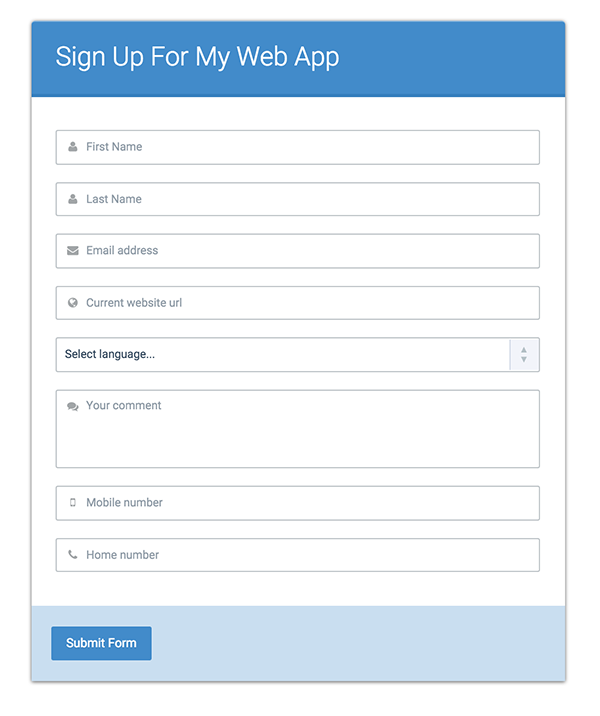

## Learning Objectives

After completing this assignment, you should:

* Understand the basics of jQuery $.ajax() and $.getJSON()
* Understand how to use a jQuery based Promise (deferred) and how Async works.

## Deliverables

1. Submit the URL to your github repo
2. Deploy to Surgh.sh and put a link in your Readme.md

## Normal Mode

* Use this Form Data to create a form on a page.
* Note, this might change during the project, so make sure to account for everything.

## Screenshot

